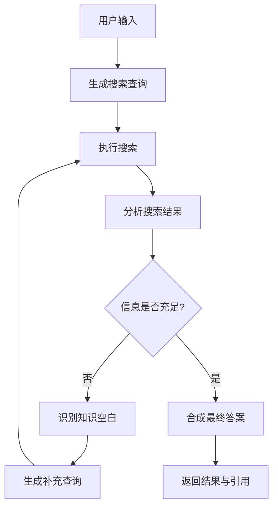

# 项目架构深度分析

## 🏗️ 系统整体架构

### 技术栈概览
```
┌─────────────────┐    ┌─────────────────┐    ┌─────────────────┐
│   React前端     │    │   LangGraph     │    │   外部服务      │
│                 │    │      后端       │    │                 │
│ • Vite         │◄──►│ • FastAPI      │◄──►│ • Google Search │
│ • TypeScript   │    │ • LangGraph    │    │ • Gemini API    │
│ • Tailwind CSS │    │ • Redis        │    │ • PostgreSQL    │
│ • Shadcn UI    │    │ • AsyncIO      │    │                 │
└─────────────────┘    └─────────────────┘    └─────────────────┘
```

## 🔄 Agent 工作流程详解

### 状态图结构


### 核心节点功能

#### 1. Query Generation Node (查询生成节点)
- **文件**: `backend/src/agent/graph.py` - `generate_queries`
- **功能**: 基于用户输入生成多个搜索查询
- **模型**: Gemini-1.5-flash
- **输入**: 用户问题
- **输出**: 搜索查询列表

#### 2. Search Node (搜索节点) 
- **文件**: `backend/src/agent/graph.py` - `search_web`
- **功能**: 执行网络搜索并收集结果
- **工具**: Google Search API
- **输入**: 搜索查询列表
- **输出**: 搜索结果集合

#### 3. Reflection Node (反思节点)
- **文件**: `backend/src/agent/graph.py` - `reflect_on_search`
- **功能**: 分析搜索结果，判断信息充足性
- **模型**: Gemini-1.5-flash
- **输入**: 问题 + 搜索结果
- **输出**: 反思结论 + 后续查询建议

#### 4. Answer Generation Node (答案生成节点)
- **文件**: `backend/src/agent/graph.py` - `generate_answer`
- **功能**: 基于收集的信息合成最终答案
- **模型**: Gemini-1.5-flash
- **输入**: 问题 + 所有搜索结果
- **输出**: 结构化答案 + 引用来源

## 📁 文件结构详解

### 后端架构
```
backend/
├── src/agent/
│   ├── __init__.py          # 模块初始化
│   ├── app.py              # LangGraph 应用定义
│   ├── configuration.py    # 配置管理和验证
│   ├── graph.py            # 核心状态图逻辑 ⭐
│   ├── prompts.py          # 提示词模板 ⭐
│   ├── state.py            # 状态数据结构 ⭐
│   ├── tools_and_schemas.py # 工具定义和数据模式
│   └── utils.py            # 工具函数
├── .env.example            # 环境变量模板
├── langgraph.json          # LangGraph 配置
├── pyproject.toml          # Python 依赖和配置
├── Makefile                # 构建和运行脚本
└── test-agent.ipynb        # Jupyter 测试笔记本
```

### 前端架构
```
frontend/
├── src/
│   ├── components/         # React 组件
│   ├── App.tsx            # 主应用组件
│   ├── main.tsx           # 应用入口
│   └── index.css          # 全局样式
├── public/                # 静态资源
├── package.json           # Node.js 依赖
├── vite.config.ts         # Vite 配置
├── tailwind.config.js     # Tailwind CSS 配置
└── components.json        # Shadcn UI 配置
```

## 🔧 关键代码分析

### 1. 状态定义 (state.py)
```python
from typing import Annotated, List
from typing_extensions import TypedDict
from langgraph.graph.message import add_messages

class State(TypedDict):
    # 消息历史 - 使用 add_messages 函数进行累积
    messages: Annotated[List[BaseMessage], add_messages]
    # 搜索查询列表
    search_queries: List[str]
    # 搜索结果
    search_results: List[dict]
    # 反思轮数
    reflection_count: int
    # 最终答案
    final_answer: str
```

### 2. 提示词设计 (prompts.py)
- **查询生成提示词**: 指导模型从用户问题中提取关键搜索词条
- **反思提示词**: 评估搜索结果质量，识别信息空白
- **答案生成提示词**: 整合信息，生成结构化回答

### 3. 图结构定义 (graph.py)
```python
# 创建状态图
graph = StateGraph(State)

# 添加节点
graph.add_node("generate_queries", generate_queries)
graph.add_node("search_web", search_web)
graph.add_node("reflect_on_search", reflect_on_search)
graph.add_node("generate_answer", generate_answer)

# 定义边和条件路由
graph.add_edge(START, "generate_queries")
graph.add_edge("generate_queries", "search_web")
graph.add_edge("search_web", "reflect_on_search")
graph.add_conditional_edges(
    "reflect_on_search",
    should_continue_research,  # 条件函数
    {
        "continue": "search_web",  # 继续搜索
        "finish": "generate_answer"  # 生成答案
    }
)
```

## 🎯 核心设计模式

### 1. 状态驱动的工作流
- 所有节点共享状态对象
- 状态在节点间传递和更新
- 支持状态检查点和恢复

### 2. 条件路由
- 基于搜索结果质量决定下一步
- 最大迭代次数限制防止无限循环
- 灵活的决策逻辑

### 3. 工具集成
- 模块化的工具定义
- 标准化的输入输出格式
- 易于扩展新的工具

### 4. 流式响应
- 实时状态更新
- 前端渐进式显示
- 良好的用户体验

## 🚀 性能优化要点

### 1. 并发搜索
- 多个搜索查询并行执行
- 异步I/O处理
- 连接池管理

### 2. 缓存策略
- 搜索结果缓存
- 模型响应缓存
- Redis 作为缓存层

### 3. 资源管理
- 连接池复用
- 内存使用优化
- 优雅的错误处理

## 🔍 调试和监控

### 1. LangSmith 集成
- 执行轨迹追踪
- 性能指标监控
- 调试信息记录

### 2. 日志系统
- 结构化日志记录
- 不同级别的日志
- 便于问题排查

### 3. 健康检查
- API 端点状态监控
- 依赖服务检查
- 自动恢复机制

---

## 📚 延伸阅读

1. [LangGraph 概念详解](https://langchain-ai.github.io/langgraph/concepts/)
2. [Agent 架构最佳实践](https://langchain-ai.github.io/langgraph/how-tos/)
3. [Google Gemini API 文档](https://ai.google.dev/docs)
4. [React 状态管理指南](https://react.dev/learn/managing-state)
