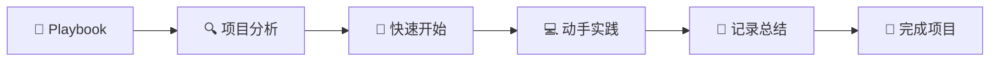

# Joseph Learns LangGraph 🤖

> 基于 Google Gemini Fullstack LangGraph Quickstart 的深度学习实践

欢迎来到我的 LangGraph 学习之旅！这个仓库记录了我学习和实践 LangGraph 构建智能研究助手的完整过程。

## 🎯 项目目标

通过深入分析和重构 [Google Gemini Fullstack LangGraph Quickstart](https://github.com/google-gemini/gemini-fullstack-langgraph-quickstart) 项目，掌握：

- **LangGraph** 状态图和 Agent 架构设计
- **RAG (检索增强生成)** 系统实现
- **全栈开发** React + Python + LangGraph
- **AI Agent** 工作流程设计和优化
- **生产级部署** Docker 容器化和运维

## 📚 学习文档导航

### 🏗️ 核心文档
- **[📖 学习 Playbook](LANGGRAPH_LEARNING_PLAYBOOK.md)** - 10天完整学习计划
- **[🔍 项目架构分析](PROJECT_ANALYSIS.md)** - 深度技术分析和代码解读
- **[🚀 快速开始指南](QUICK_START.md)** - 立即动手实验
- **[📝 学习进度记录](LEARNING_LOG.md)** - 个人学习日志模板

### 🛣️ 学习路径



## 🌟 原项目特性

基于 Google 的开源项目，该系统实现了：

- 🧠 **智能研究助手** - 基于 LangGraph 的 Agent 架构
- 🔍 **动态搜索策略** - 自动生成和优化搜索查询
- 🌐 **多源信息聚合** - 集成 Google Search API
- 🤔 **反思式学习** - 识别知识空白并迭代改进
- 📄 **引用生成** - 提供可验证的信息来源
- 💬 **全栈应用** - React 前端 + FastAPI 后端

## 🛠️ 技术栈

### 前端技术
- **React** + **TypeScript** - 现代前端框架
- **Vite** - 快速构建工具
- **Tailwind CSS** - 实用优先的 CSS 框架
- **Shadcn UI** - 高质量组件库

### 后端技术
- **LangGraph** - AI Agent 框架
- **FastAPI** - 高性能 Python Web 框架
- **Google Gemini** - 先进的语言模型
- **Redis** + **PostgreSQL** - 数据存储和缓存

### 开发工具
- **Docker** - 容器化部署
- **LangSmith** - Agent 调试和监控
- **Google Search API** - 网络搜索集成

## 🚀 快速体验

想要立即开始？跳转到 **[🚀 快速开始指南](QUICK_START.md)**

```bash
# 克隆原始项目
git clone https://github.com/google-gemini/gemini-fullstack-langgraph-quickstart.git

# 配置环境变量
echo 'GEMINI_API_KEY="your_api_key"' > backend/.env

# 启动项目
make dev
```

## 📈 学习进度跟踪

### 当前状态
- [x] 项目分析完成
- [x] 学习计划制定
- [x] 文档框架建立
- [ ] 开始实践学习
- [ ] 功能扩展实验
- [ ] 项目部署测试

### 学习阶段
1. **🔧 环境准备** (第1-2天) - 工具安装和基础理解
2. **📖 项目分析** (第3天) - 代码结构和工作流程分析
3. **💻 后端实践** (第4-6天) - Agent 开发和工具集成
4. **🎨 前端开发** (第7-8天) - React 应用和界面优化
5. **🚀 部署优化** (第9-10天) - 容器化和性能调优

## 💡 学习亮点

### 核心概念掌握
- **状态图设计** - 理解 Agent 的决策流程
- **提示词工程** - 优化 AI 模型的输出质量
- **工具集成** - 扩展 Agent 的外部能力
- **流式响应** - 实现实时用户交互

### 实践技能
- **调试技巧** - 使用 LangSmith 追踪执行过程
- **性能优化** - 缓存策略和并发处理
- **错误处理** - 构建健壮的 AI 应用
- **部署运维** - Docker 容器化和生产配置

## 🤝 学习社区

### 获取帮助
- **GitHub Issues** - 在本仓库提问
- **LangGraph Discord** - 官方社区讨论
- **原项目讨论** - 参与开源项目交流

### 贡献方式
- 📝 分享学习心得和改进建议
- 🐛 报告问题和解决方案
- 🔧 提交代码改进和功能扩展
- 📚 完善文档和教程

## 📊 项目统计

- **学习周期**: 10 天强化学习
- **代码文件**: 20+ 核心文件分析
- **实践练习**: 15+ 动手实验
- **技术栈**: 8+ 主要技术
- **文档页面**: 4 个完整指南

## 🔗 相关资源

### 官方文档
- [LangGraph 文档](https://langchain-ai.github.io/langgraph/)
- [Google Gemini API](https://ai.google.dev/docs)
- [原始项目仓库](https://github.com/google-gemini/gemini-fullstack-langgraph-quickstart)

### 学习资源
- [LangChain 官方教程](https://python.langchain.com/docs/get_started/)
- [React + TypeScript 指南](https://react-typescript-cheatsheet.netlify.app/)
- [FastAPI 快速上手](https://fastapi.tiangolo.com/tutorial/)

---

## 📞 联系方式

有问题或想要交流学习心得？

- **GitHub Issues**: 在本仓库创建 Issue
- **讨论区**: 使用 GitHub Discussions

---

<div align="center">

**🎯 目标明确，步步为营，让我们一起掌握 LangGraph！**

[](LANGGRAPH_LEARNING_PLAYBOOK.md)
[](QUICK_START.md)

</div>
